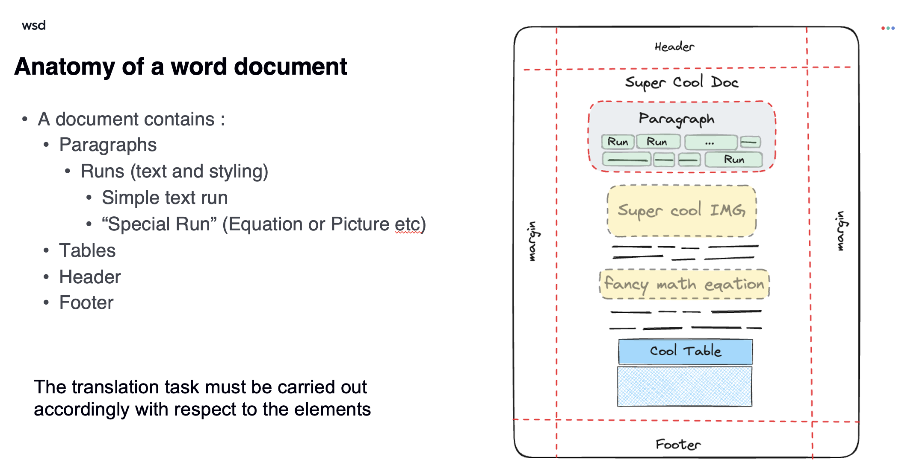
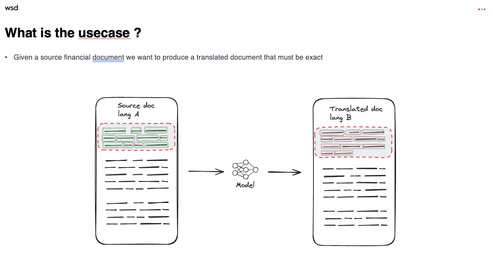

# The Translation Exercise

## Situation
Our human translator is in holidays and we urgently need a system for translating documents within the next couple of hours.  
We need a production-ready translation API capable of translating documents and providing a full-fledged API.

Luckily, an engineer from your team has already drafted a small python script that can translate documents from English to French, but he now needs your help to make it production-ready and faster. 

## Instructions

We have two exercises: one for translating documents and another for developing a complete API.
Ideally, both exercises should be tackled. 
Exercise 1 is more important.
Exercise 2 should be tackled only if you have time left over after completing the first exercise, if done properly it is a big plus. 

If you are struggling of lacking code time, do not hesitate to write your thoughts in `tasks.md` file. 

## Exercise 1 - Production-Ready Code (recommended 2 hours)

- Improve code readability, add execution tracking with logging, and refactor the code to support more languages than just English and French.

- Using the API framework of your choice, develop a complete API that leverages `translate_docx.py` to translate documents. This API should be able to accept an uploaded Word document, the source and target languages, and return the translated version in the same format. Add clear error handling of your choice.

- Dockerize this application using Docker and docker compose, ensuring that all dependencies and configurations are properly encapsulated.
  
- Provide a detailed `README_api.md` so that your colleagues can easily launch and test the API.

## Exercise 2 - Optimization (recommended 1 hours)
Currently, the code is very slow (arround 200 seconds per file). Use your knowledge of python and its libraries to optimize the code. Propose improvements and optimizations to make it run faster.

- Leverage the `TODO (ex.2)` markers within the code, as they suggest areas where you should focus on improving performance.
- Use your knowledge of python and its libraries to optimize the code.
- While there is a specific codeblock you should not touch. You are allowed to create additional functions or classes. Full freedom of creativity here, but do not change the output format.

Hint 1 : Thoses multiples steps progress bars are anoying isn't it ? Start with having a global progress bar. 

Hint 2 : Do not spend too much time executing the code because you will wait arround 200 seconds. Use ctrl-C to to stop it when you are just applying small changes changes 

The target is to achieve a translation time below 20 seconds for a document. But any speedup will be appreciated. 